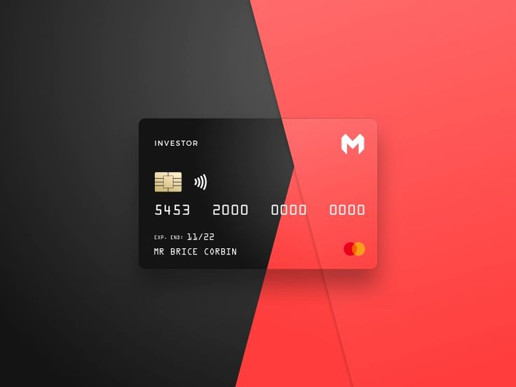

# Fraudulent Credit Card Transaction Detection

## Overview
1. Credit card companies must be able to recognize fraudulent credit card transactions in order to provide safe banking to their customers.
2. The Dataset is highly imbalanced. So we must achieve high recall such that we should not miss any fraud transaction. 
3. This was one of the Kaggle competition and the dataset was made available on Kaggle.
The dataset can be downloaded [here](https://www.kaggle.com/mlg-ulb/creditcardfraud) from Kaggle.
