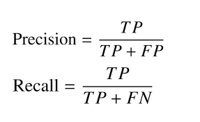
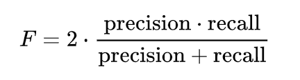
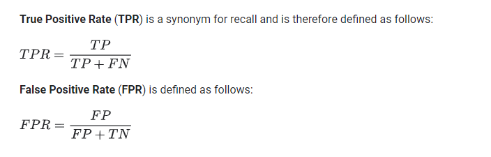

# Fraudulent Credit Card Transaction Detection

## Overview
1. Credit card companies must be able to recognize fraudulent credit card transactions in order to provide safe banking to their customers.
2. The Dataset is highly imbalanced. So we must achieve high recall such that we do not miss any fraudulent transactions. 
3. This was one of the Kaggle competitions and the dataset was made available on Kaggle.

## Imbalanced Classification

Please refer to this [article](https://www.analyticsvidhya.com/blog/2021/06/5-techniques-to-handle-imbalanced-data-for-a-classification-problem/) for how to deal with imbalanced data.

Classification predictive modeling involves predicting a class label for a given observation.

An imbalanced classification problem is an example of a classification problem where the distribution of examples across the known classes is biased or skewed. The distribution can vary from a slight bias to a severe imbalance where there is one example in the minority class for hundreds, thousands, or millions of examples in the majority class or classes.

Imbalanced classifications pose a challenge for predictive modeling as most of the machine learning algorithms used for classification were designed around the assumption of an equal number of examples for each class. This results in models that have poor predictive performance, specifically for the minority class. This is a problem because typically, the minority class is more important and therefore the problem is more sensitive to classification errors for the minority class than the majority class.

## Dataset
The dataset can be downloaded from [Kaggle](https://www.kaggle.com/mlg-ulb/creditcardfraud).

1. The dataset contains transactions made by credit cards in September 2013 by European cardholders.
2. This dataset presents transactions that occurred in two days, where we have 492 frauds out of 284,807 transactions.
3. The dataset is highly unbalanced, the positive class (frauds) accounts for 0.172% of all transactions.
4. It contains only numerical input variables which are the result of a PCA transformation.
5. Unfortunately, due to confidentiality issues, they cannot provide the original features and more background information about the data.
6. Features V1, V2, … V28 are the principal components obtained with PCA, the only features which have not been transformed with PCA are 'Time' and 'Amount'.
7. Feature 'Time' contains the seconds elapsed between each transaction and the first transaction in the dataset.
8. The feature 'Amount' is the transaction Amount, this feature can be used for example-dependent cost-sensitive learning.
9. Feature 'Class' is the response variable and it takes value 1 in case of fraud and 0 otherwise.

**This is a highly imbalanced dataset with the following classes**     
**Class 0 - 284315**    
**Class 1 - 492**   

## EDA and Feature Engineering 
Most of the EDA and Feature Engineering work has been already done by the dataset provider.

1. Read and view the data file.
2. Make sure that all features are numeric and null values are removed completely.
3. View and plot the class count.

## Evaluation and Metrics for Imbalanced Data
The dataset is highly imbalanced so the model performance should be evaluated on Precision, Recall, F1 Score, Precision-Recall Curve, ROC Curve and AUC

### 1. Precision
It tells us about what proportion of positive identifications was actually correct.

### 2. Recall 
It tells us about what proportion of actual positives was identified correctly.

We can understand them better in mathematical formulas as given below:

Where, TP: True Positive
       TN: True Negative
       FP: False Positive
       TN: False Negative

### 3. F1 Score
It is defined as the harmonic mean of precision and recall

### 4. Confusion Matrix
It is a table that is used in classification problems to assess where errors in the model were made.  

The rows represent the actual classes and the columns represent the predictions we have made. Using this table it is easy to see which predictions are wrong.

### 4. Precision-Recall Curve
It is simply a graph with Precision values on the y-axis and Recall values on the x-axis.

### 5. ROC Curve
A ROC curve (receiver operating characteristic curve) is a graph showing the performance of a classification model at all classification thresholds. This curve plots two parameters:

1. True Positive Rate
2. False Positive Rate

### 6. AUC
AUC (Area under the ROC Curve) measures the entire two-dimensional area underneath the entire ROC curve.

## Gradient Boosting Classifier

##### In this highly imbalanced data, we should not miss any fraudulent transaction and hence we must achieve high Recall.

### Model fitting using Gradient Boosting Classifier

1. Split the dataset into train and test sets.
2. Gradient Boosting does not require any feature scaling.
3. Import and fit the model.
4. Predict for test data.
6. Evaluate Recall, Precision and F1 Score between y_test and y_pred.
7. Plot the Confusion Matrix for y_test and y_pred.
8. Plot the Precision-Recall curve for y_test and y_pred.
9. Plot the ROC curve for y_test and y_pred.
10. Calculate the AUC between y_test and y_pred.

### Gradient Boosting Classifier Performance

### Confusion Matrix

### Precision-Recall Curve

### ROC curve and AUC

## Random Forest Classifier

##### In this highly imbalanced data, we should not miss any fraudulent transaction and hence we must achieve high Recall.

### Model fitting using Random Forest Classifier

1. Split the dataset into train and test sets.
2. Random Forest does not require any feature scaling.
3. Import and fit the model.
4. Predict for test data.
6. Evaluate Recall, Precision and F1 Score between y_test and y_pred.
7. Plot the Confusion Matrix for y_test and y_pred.
8. Plot the Precision-Recall curve for y_test and y_pred.
9. Plot the ROC curve for y_test and y_pred.
10. Calculate the AUC between y_test and y_pred.

### Random Forest Classifier Performance

### Confusion Matrix

### Precision-Recall Curve

### ROC curve and AUC

## XGBoost Classifier

##### In this highly imbalanced data, we should not miss any fraudulent transaction and hence we must achieve high Recall.

### Model fitting using XGBoost Classifier

1. Split the dataset into train and test sets.
2. XGBoost does not require any feature scaling.
3. Import and fit the model.
4. Predict for test data.
6. Evaluate Recall, Precision and F1 Score between y_test and y_pred.
7. Plot the Confusion Matrix for y_test and y_pred.
8. Plot the Precision-Recall curve for y_test and y_pred.
9. Plot the ROC curve for y_test and y_pred.
10. Calculate the AUC between y_test and y_pred.

### XGBoost Classifier Performance

### Confusion Matrix

### Precision-Recall Curve

### ROC curve and AUC

